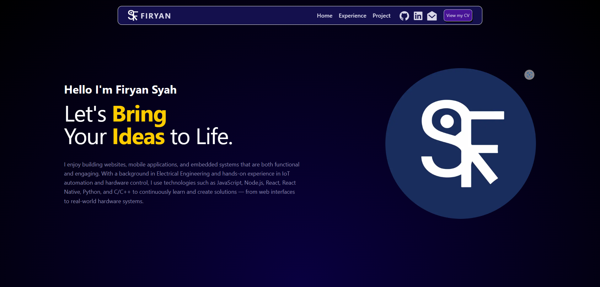
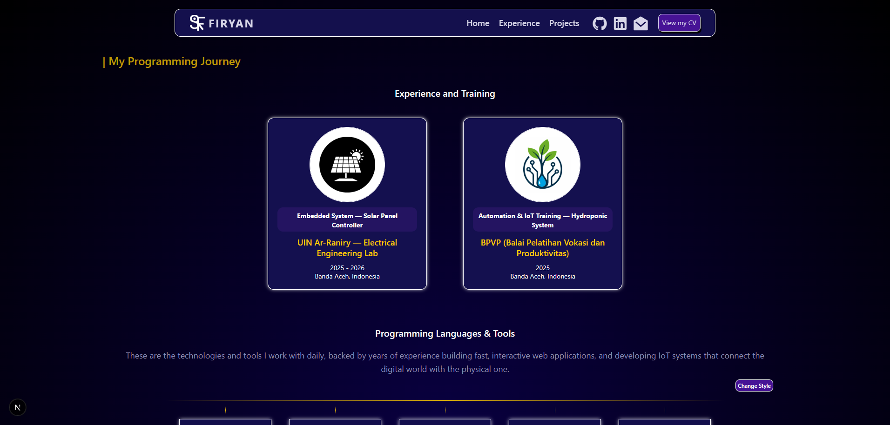
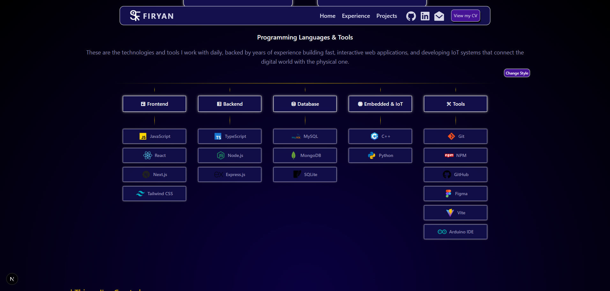
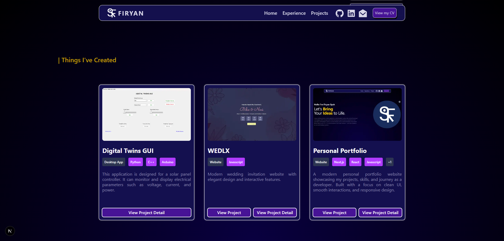

# 🚀 Firyan Portfolio | Let's Bring Your Ideas to Life.

A modern and responsive personal portfolio website built with **Next.js** and **Tailwind CSS** to showcase my projects, skills, and experience into showcase my projects, skills, and experience in web development & IoT

<p align="center">
  
</p>

<p align="center ">
  
  
  
  
  
  
</p>

<p align="center">
  
  <a href="https://firyansyah-portfolio.vercel.app/">
    
  </a>
</p>

---

## ✨ Features

- Responsive design
- Modern UI with smooth animations
- Experience and programming journey section
- Technology stack showcase
- Projects gallery
- Dynamic project detail pages
- Downloadable CV
- SEO support with sitemap and robots.txt
- Built with reusable components

---

## 🛠 Tech Stack

### Frontend

- Next.js
- React
- Tailwind CSS
- Framer Motion

### Backend

- Node.js
- Express.js

### Database

- MySQL
- MongoDB
- SQLite

### Languages

- JavaScript
- TypeScript
- Python
- C++

### Tools

- Git
- GitHub
- Figma
- Vite
- NPM
- Arduino IDE

---

## 📸 Website Sections

### 🏠 Home

Introduction section with personal branding and social links.

### 💼 Experience

Programming journey, training, and achievements.

### 🛠 Skills

Programming languages and tools used in daily development.

### 📂 Projects

Collection of projects with dedicated detail pages.

### 📄 Footer

Contact information and navigation links.

---

## 📸 Preview

### Home Page


### Experience Section



### Skills Section



### Projects Section



---

## ⚡ Getting Started

Clone repository:

```bash
git clone https://github.com/username/firyansyah-portfolio.git
```

Move into project directory:

```bash
cd name-portfolio
```

Install dependencies:

```bash
pnpm install
```

Run development server:

```bash
pnpm dev
```

Open:

```text
http://localhost:3000
```

---

## 👨‍💻 Author

### Firyan Syah

Full-Stack Developer | IoT Enthusiast

📍 Banda Aceh, Indonesia

### Connect With Me

- 🔗 [GitHub](https://github.com/FiryanSyah23)
- 💼 [LinkedIn](https://linkedin.com/in/username-kamu)
- 📧 [Email](mailto:email@kamu.com)

---

## ⭐ Support

If you like this project, don't forget to give it a ⭐ on GitHub.

---

## 📄 License

This project is licensed under the MIT License.
